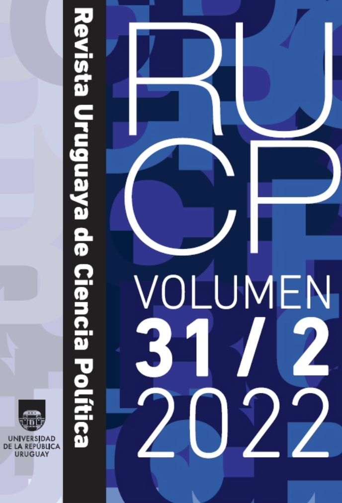

:::float-image

```{r out.width='40%px', out.extra='style="float:left; padding:10px "', echo=FALSE}

```

The 1996 electoral reform made departmental elections independent from national elections in Uruguay and configured traditional first-past-the-post systems at the sub-national level. Yet, they preserved a voting mechanism called Double Simultaneous Vote that is crucial for the dynamic of the contest. This article proposes an adaptation of the classic theory of electoral coordination, considering the effects of that mechanism. Specifically, it argues that the upper limit of effective candidates in the system is four, which is twice the upper limit of a traditional majoritarian electoral system. This argument is tested using data for Uruguay during the 1971 to 2020 period.

[Download **HERE** ](https://doi.org/10.26851/RUCP.31.2.2) or read it in English [**HERE**](coordinacionEnglish.pdf).
:::


[Cite APA](APAcoordinacion2022.txt)  

[Cite Bibtex](BIBcoordinacion2022.bib)

