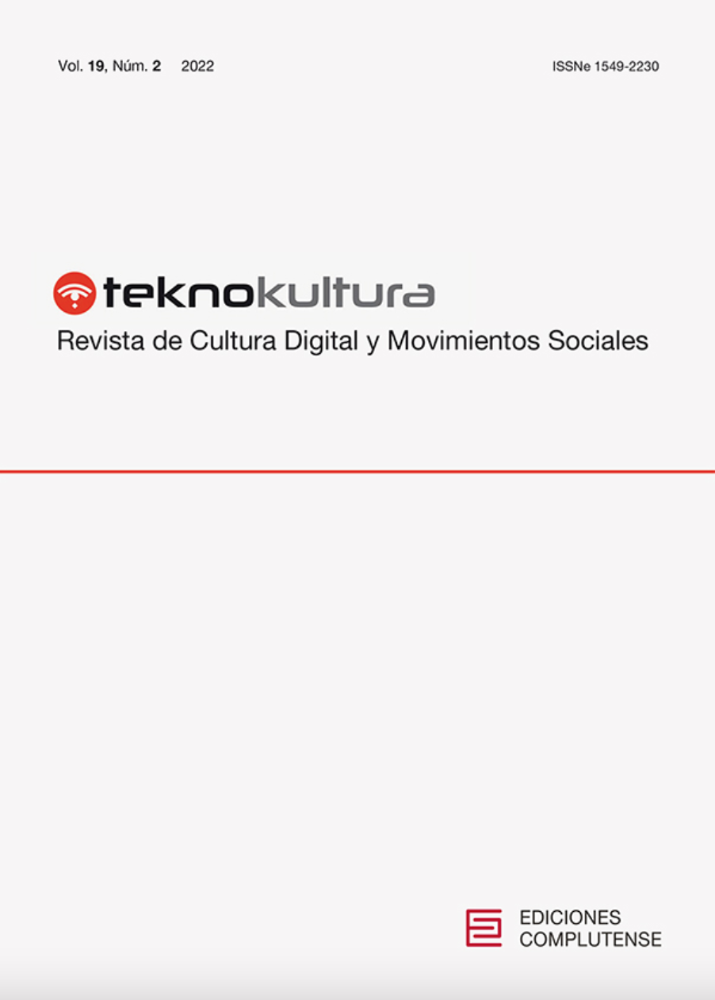

:::float-image

```{r out.width='40%px', out.extra='style="float:left; padding:10px "', echo=FALSE}

```

The declaration of a public health emergency for COVID-19 forced the traditional March of Silence, one of the largest marches in Uruguay, to move completely online. In this unusual context, the article examines how public memories are developed through a quantitative analysis of Twitter activity that analyzed the struggle over memories of Uruguay’s recent past. As with the results of other research, thispaper  demonstrates  that  there  are  at  least  two  opposing  public  memories:  the  predominant  one which  has  state  terrorism  as  its  central  concept  and  is  linked  to  the  political  left;  and  an  alternative memory which follows the theory of the two demons. For each of the memories in this virtual battle, the article describes the associated actors and their social ties, including the participation of political parties, legislators, and state ministers.

[Download **HERE** ](https://revistas.ucm.es/index.php/TEKN/article/view/82642/4564456563624)
:::


[Cite APA](APAmarcha.txt)  

[Cite Bibtex](BIBmarcha.bib)

