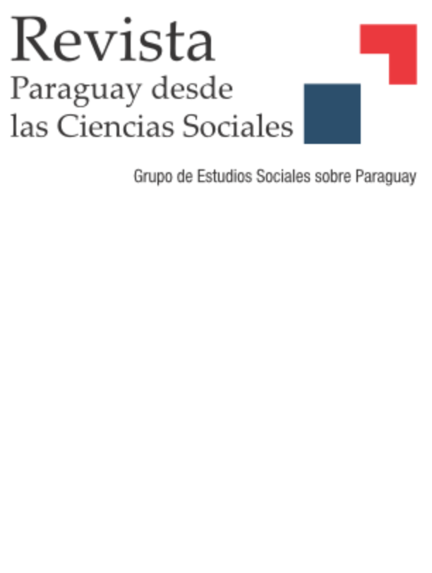

:::float-image

```{r out.width='40%px', out.extra='style="float:left; padding:10px "', echo=FALSE}

```

The institutionalization of a party system has traditionally been considered relevant to the democratic quality of a country. This work investigates the institutionalization of the Paraguayan party system in two dimensions: the stability of the electoral competition and the rootedness of parties in society. At the same time, this work focuses on the ideological component of this linkage. Here, it is shown that the Paraguayan party system is stable over time and across the territory. It is a slightly ideologically polarized system, but there is a trend of higher polarization in legislative elites and evident ideological differences among voters of different parties.


[Download **HERE** ](https://publicaciones.sociales.uba.ar/index.php/revistaparaguay/article/download/7846/7558)
:::


[Cite APA](APAparaguay2023.txt)  

[Cite Bibtex](BIBparaguay2023.bib)

