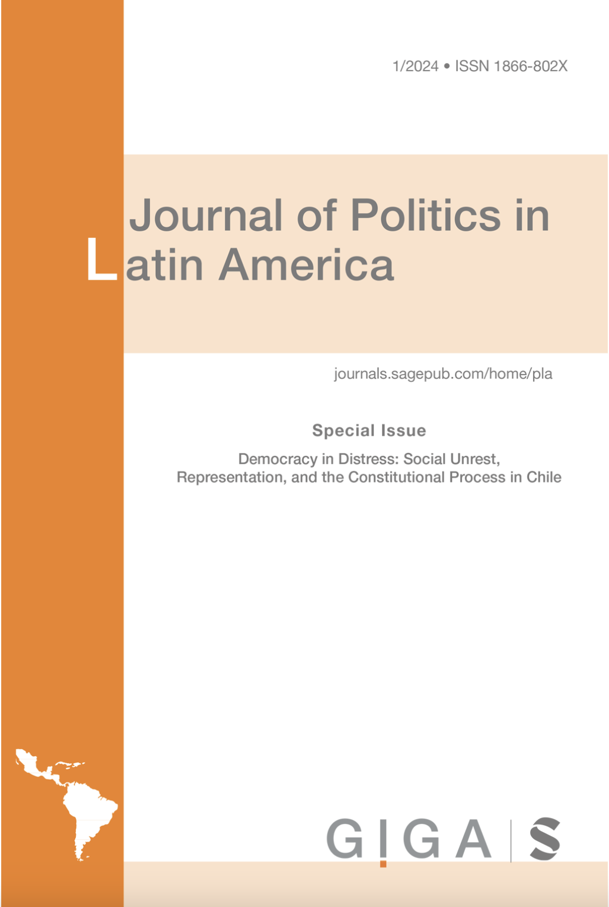

:::float-image

```{r out.width='40%px', out.extra='style="float:left; padding:10px "', echo=FALSE}

```

Latin American democracies have been characterised as the product of personalistic leaders relying on their unique qualities to achieve and maintain political power. However, this characterisation has lacked conceptual and empirical development since the term “personalism” has been used to account simultaneously for a particular type of electoral appeal seeking to mobilise and persuade voters and for the concentration of power in a single political leader. This article advances in conceptualising electoral personalism as a strategy followed by political elites appealing to voters based on the personal characteristics of leaders and candidates, distinguishing it from personalisation as the concentration of power in a single leader. Based on statistical analysis, we propose two novel indicators of electoral personalism and assess its prevalence among Latin American countries. The article also advances in exploring its political, economic, and social determinants at the aggregate and individual levels.

[Download **HERE** ](https://journals.sagepub.com/doi/10.1177/1866802X241250034)
:::


[Cite APA](APApersonalism.txt)  

[Cite Bibtex](BIBpersonalism.bib)

