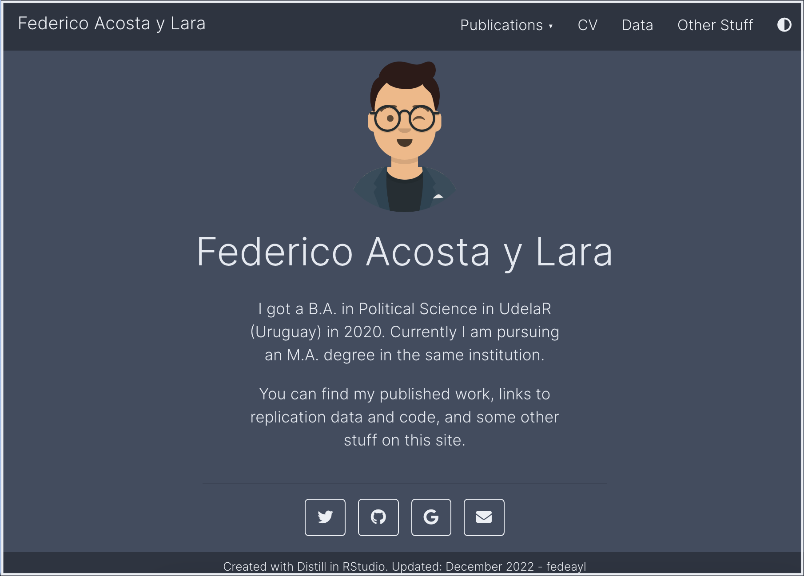

:::float-image

```{r out.width='40%px', out.extra='style="float:left; padding:10px "', echo=FALSE}

```

This site was built using [**RStudio**](https://posit.co) and the [**Distill package**](https://rstudio.github.io/distill). 

You can access to the complete code of this site [**here** <i class="fab fa-github"></i> ](https://github.com/Fedeayl/website).

:::

Some valuable resources that have helped me a lot are:

- [***Building websites in R with Distill***](https://www.youtube.com/playlist?list=PLpZT7JPM8_GZlqEssUJ6ABm0rblI1cBEW): It is a YouTube tutorial on building websites using Distill. Very detailed and great for beginners.  

- [***Distill for R Markdown***](https://rstudio.github.io/distill/website.html): A useful blog that teaches how to develop not only websites but also articles and blogs.

- [***rstudio4edu***](https://rstudio4edu.github.io/rstudio4edu-book/intro-distill.html): An online handbook designed to help in the design of educational content using R Markdown. Many useful details. 


