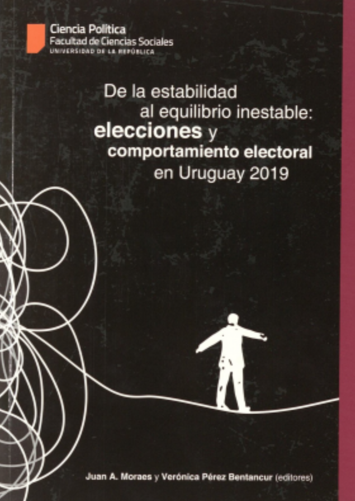

:::float-image

```{r out.width='40%px', out.extra='style="float:left; padding:10px "', echo=FALSE}

```
In this chapter we analyzed the Uruguayan political system from a comparative perspective. We showed that our system is less volatile and less fragmented than almost any other on the region. On the contrary, it is the most ideologically polarized. Looking for a temporal trend, we find a growing pattern in all of them. 

[**ISBN** 978-9974-8594-3-2](http://isbn.bibna.gub.uy/catalogo.php?mode=detalle&nt=42860)

[Cite APA](APAelecciones2019.txt)

[Cite Bibtex](elecciones2019.bib)


:::

[View Graphs](Gráficos.pdf)


