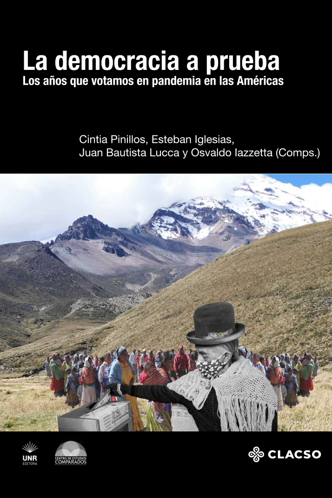

:::float-image

```{r out.width='40%px', out.extra='style="float:left; padding:10px "', echo=FALSE}

```
In this chapter we use a rational choice approach to analyze the effects of the COVID-19 pandemic on the 2020 Uruguayan sub-national elections turnout. 

[**ISBN** 978-987-813-093-4](http://isbn.bibna.gub.uy/catalogo.php?mode=detalle&nt=42860)

[Cite APA](APAdepcovid2021.txt)

[Cite Bibtex](BIBdepcovid2021.bib)


:::

Download the chapter [HERE](depcovidCHP.pdf)

Download the book [HERE](http://rephip.unr.edu.ar/xmlui/bitstream/handle/2133/23410/La-democracia-a-prueba.pdf?sequence=3)


