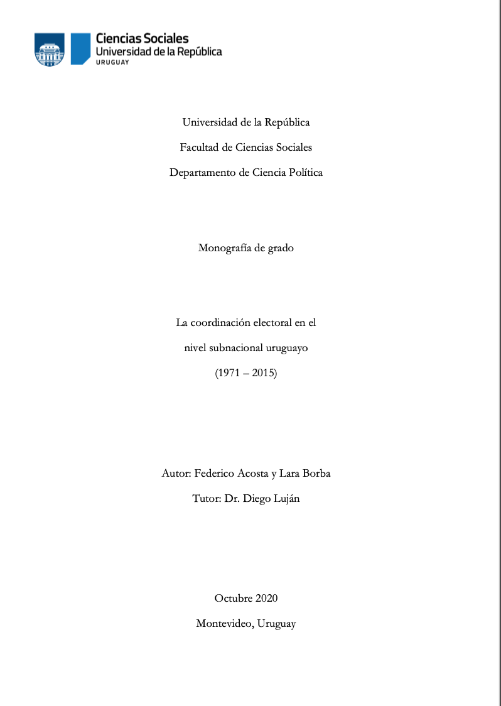

 

:::float-image

```{r out.width='40%px', out.extra='style="float:left; padding:10px "', echo=FALSE}

```

In my undergraduate thesis I studied the electoral coordination process on the subnational level in Uruguay. 

[Download **HERE** ](https://hdl.handle.net/20.500.12008/26081)

[Cite APA](APAthesis.txt)  

[Cite Bibtex](BIBthesis.bib)

:::


